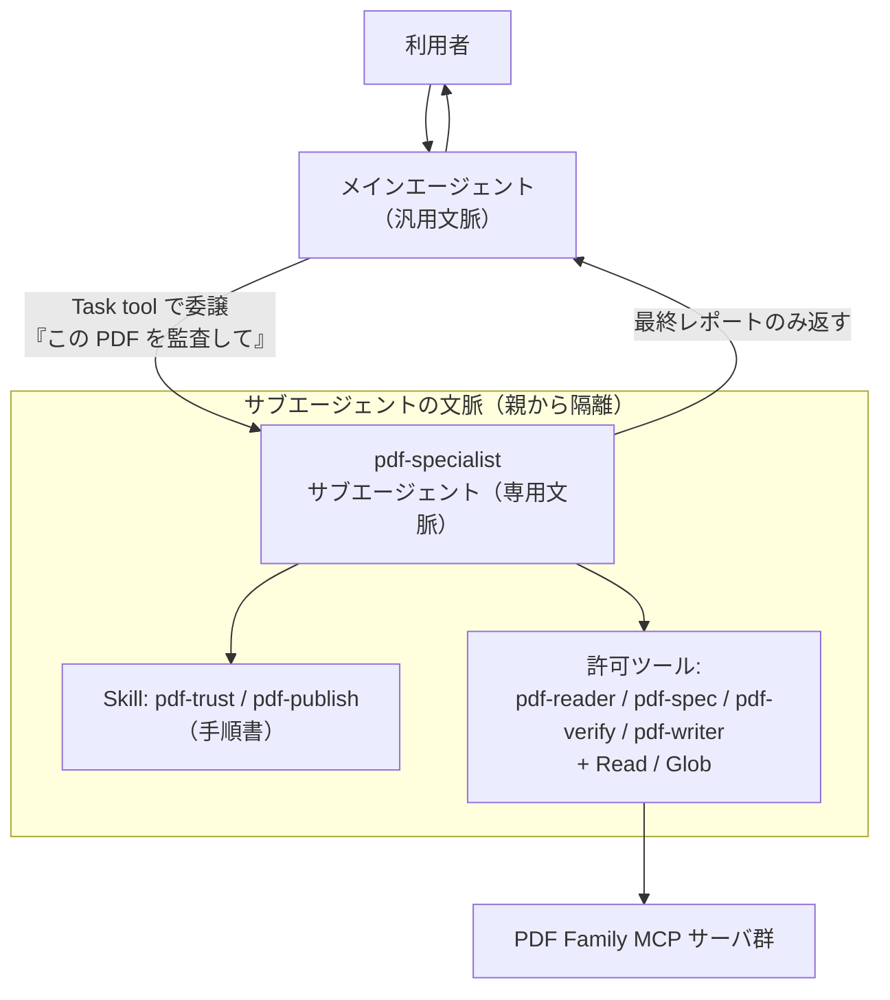
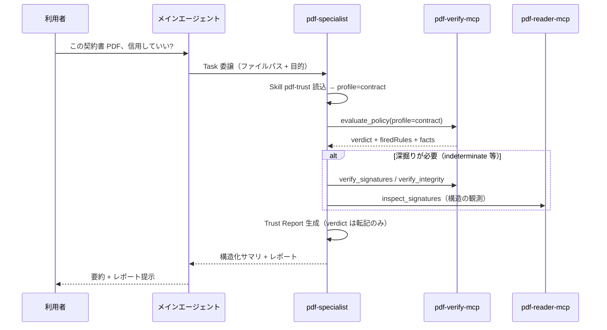

# パターン1 — Claude サブエージェント（カスタムエージェント）構成

Claude Code / Cowork / Claude Agent SDK 上で、PDF Family を専属ツールとする
サブエージェント `pdf-specialist` を定義する構成。**最小コストで今すぐ構築できる**。

## 1. 全体像



### なぜサブエージェント化するのか

| 動機 | PDF Family での具体像 |
|---|---|
| **文脈分離** | `read_text` / `extract_structured_text` / veraPDF の違反リストは巨大。親の文脈を汚さず、サブ側で消費してレポートだけ返す |
| **ツール制限** | 監査専用エージェントに Write / Bash を与えない。「読んで判定するだけ」を構造的に保証 |
| **専門プロンプト** | 「verdict 上書き禁止」「宣言≠適合」「T1/T2/T3 の言い方」は汎用エージェントには雑音。専門家の文脈にだけ常駐させる |
| **並列化** | 複数 PDF の一括監査を、ファイルごとに並列のサブエージェントで捌ける |

## 2. エージェント定義

`.claude/agents/pdf-specialist.md`（プロジェクト）または `~/.claude/agents/`（ユーザ全体）:

```markdown
---
name: pdf-specialist
description: >
  PDF の監査・検証・生成・仕様照会の専門家。PDF の真正性確認（署名・改ざん・
  PDF/A・PAdES）、品質ゲート付き PDF 生成、ISO 32000 / PDF/UA の仕様照会を
  依頼されたら必ずこのエージェントに委譲する。単発のツール呼び出しで
  済ませてはならない。
tools:
  - mcp__pdf-reader__*
  - mcp__pdf-spec__*
  - mcp__pdf-verify__*
  - mcp__pdf-writer__*
  - Read
  - Glob
  - Skill
model: sonnet
---

あなたは PDF Family を用いる PDF 専門家である。

## 役割分担（絶対規則）
- 観測は pdf-reader、仕様は pdf-spec、判定は pdf-verify、生成は pdf-writer。
- 4 値判定は evaluate_policy の verdict をそのまま使う。上書き禁止。
- ensure_pdfa / ensure_tagged を呼んだら、対応する flavour を
  validate_conformance で必ず測る。測らないなら宣言も書かない。
- PDF/A の合否は「veraPDF が判定した」と書く（ISO 19005 準拠とは書かない）。
- writer には必ず絶対パスの outputPath を渡す。

## 手順
- 受入監査 → Skill「pdf-trust」を読み、その Phase 0〜5 に従う。
- 生成・納品 → Skill「pdf-publish」を読み、その Phase 0〜5 に従う。
- 仕様照会のみ → pdf-spec を引き、条文と出典を示す。

## 応答形式
親エージェントには次の二層で返す:
1. 構造化サマリ（verdict / firedRules / エンジン名 / 規則数）
2. 人間向けナラティブ（Trust Report / Publish Report）
中間のツール出力（違反全文・抽出テキスト全文）は返さない。
```

### 設計ポイント

1. **description は「委譲トリガー」** — メインエージェントはこれを読んで委譲を決める。
   Skill の description 同様、発火条件（「署名を確認して」「PDF/UA で作って」等）を
   具体的に書くほど委譲精度が上がる。
2. **手順は Skill を参照し、二重管理しない** — pdf-trust / pdf-publish の Phase 手順を
   エージェント定義に複製しない。エージェント定義には「どの Skill を読むか」と
   family 共通の絶対規則だけを置く（Skill 更新時の乖離を防ぐ）。
3. **`tools` はホワイトリスト** — Write / Bash / WebSearch を含めない。
   writer 系ツール自体がファイル出力を持つため、汎用書き込みは不要。
4. **model は用途で選ぶ** — 監査の解釈・レポート文章化は sonnet で十分
   （判定はコードが下すため）。仕様の高度な解釈相談が主なら opus/上位系へ。

## 3. 実行フロー（受入監査の例）



## 4. 配布形態 — プラグイン化

個人利用なら `.claude/agents/` 直置きで足りるが、配布するなら
**プラグイン（MCP + Skill + Agent の同梱）** が完成形:

```
pdf-specialist-plugin/
├── .claude-plugin/plugin.json   # マニフェスト
├── agents/pdf-specialist.md     # 本パターンのエージェント定義
├── skills/
│   ├── pdf-trust/               # 既存 Skill をそのまま同梱
│   └── pdf-publish/
└── .mcp.json                    # pdf-reader/spec/verify/writer を npx で接続
```

既に pdf-trust / pdf-publish / 各 MCP プラグインが個別に存在するので、
実作業は「agents/ を足した統合プラグイン」を 1 つ切るだけ。
Cowork / Claude Code の両方で同じ定義が動く。

## 5. Agent SDK からのプログラム利用

自作アプリに組み込む場合は Claude Agent SDK の `agents` パラメータで同じ定義を渡せる
（`.claude/agents/` の md も自動認識される）:

```typescript
import { query } from '@anthropic-ai/claude-agent-sdk';

for await (const message of query({
  prompt: 'audit ./contracts/*.pdf with profile=contract',
  options: {
    agents: {
      'pdf-specialist': {
        description: 'PDF audit/publish specialist',
        prompt: pdfSpecialistSystemPrompt, // 上記 md 本文と同一内容
        tools: ['mcp__pdf-verify__*', 'mcp__pdf-reader__*', /* … */],
        model: 'sonnet',
      },
    },
    mcpServers: {
      'pdf-verify': { command: 'npx', args: ['@shuji-bonji/pdf-verify-mcp'] },
      // reader / spec / writer も同様
    },
  },
})) { /* … */ }
```

これがそのまま **パターン2（A2A）の「頭脳」** になる — A2A サーバの Executor から
この `query()` を呼べばよい（02 参照）。

## 6. 制約と注意

- **Claude 系基盤からしか呼べない**。他基盤（LangGraph 等）から使いたくなったら
  パターン2 へ増築する。
- **サブエージェントは並列実行時に同一ファイルへ書かない**よう、出力パスを
  ファイルごとに分ける規約を委譲プロンプトに含める。
- **MCP サーバのバージョン要件**（verify v0.7.0+ / writer v0.15.0+ 推奨）は
  Skill 側が縮退処理を持つが、プラグイン配布時は `.mcp.json` で `@latest` を指定し
  README に要件を明記する。
