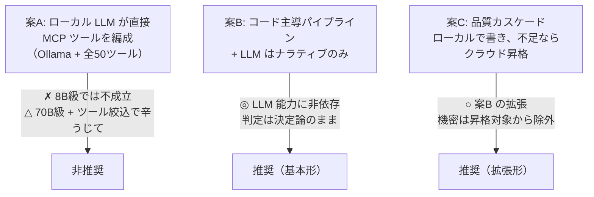
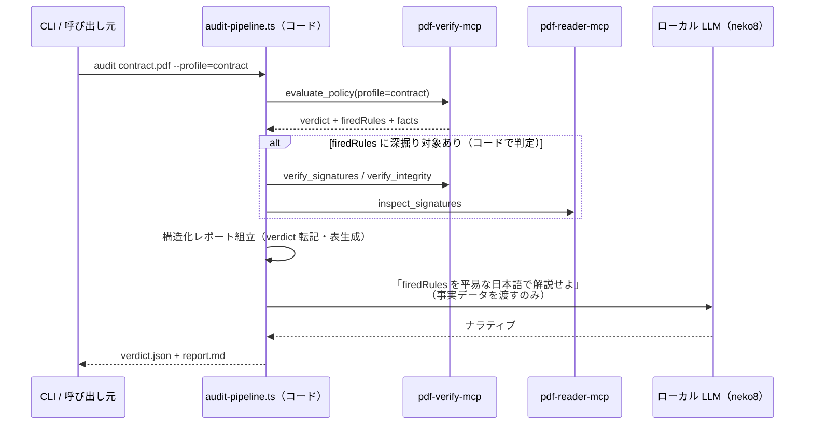
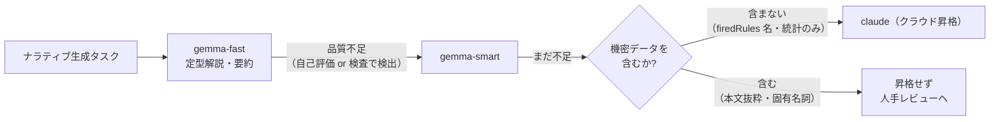
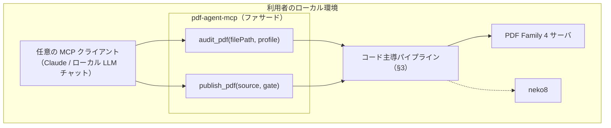

# パターン3 — ローカル LLM 構成（機密 PDF をローカルで完結させる）

契約書・診療文書・申告書など**外部 API に送れない PDF** を対象に、
ローカル LLM（neko8: gemma 系等）+ PDF Family で監査・生成を完結させる構成。

## 1. 前提認識 — ローカル LLM の制約（2026-07 時点）

| 事実 | 設計への含意 |
|---|---|
| ツール呼び出しの実用ラインは 14B+、多段チェーンは 70B 級でようやく安定 | 8B 級に PDF Family 全 50 ツールを自由選択させる構成は**成立しない** |
| PDF Family は 4 サーバ約 50 ツール + 厳密な役割分担 | ツール選択ミス（reader の観測を判定と誤読等）のリスクがクラウド LLM より格段に高い |
| 判定はもともとコード（evaluate_policy / veraPDF） | **LLM の弱さが判定品質に影響しない**設計が最初から可能 |

→ 結論: ローカル LLM に「エージェントの頭脳」をさせない。
**パイプラインはコードが編成し、LLM はナラティブ（要約・解説・翻訳）だけを担う。**

## 2. 三つの構成案と採否



### 案A を非推奨とする根拠

自由なツール編成には「pdf-trust Phase 0〜5 の手順追従」「エラー時の code 分岐」
「宣言≠適合の規律」が要る。これらはクラウド LLM でも Skill で縛って初めて守られる規律で、
ローカル 8B 級では手順の途中崩壊が常態化する。70B 級 + ツールを 5〜6 個に絞った
サブセット構成なら動くが、それだけの VRAM を張るなら案B の方が安く確実。

## 3. 案B — コード主導パイプライン（基本形）

pdf-trust / pdf-publish の Phase 手順を **TypeScript の決定論的パイプライン**に落とす。
LLM 呼び出しは最終段のレポート文章化だけ。



### 実装スケッチ

MCP クライアントは自作せず SDK の Client をそのまま使う
（PDF Family は stdio 起動なのでローカル完結）:

```typescript
import { Client } from '@modelcontextprotocol/sdk/client/index.js';
import { StdioClientTransport } from '@modelcontextprotocol/sdk/client/stdio.js';

const verify = new Client({ name: 'audit-pipeline', version: '0.1.0' });
await verify.connect(new StdioClientTransport({
  command: 'npx', args: ['@shuji-bonji/pdf-verify-mcp'],
}));

// Phase 1: 判定（決定論 — LLM 不在）
const policy = await verify.callTool({
  name: 'evaluate_policy',
  arguments: { filePath: absPath, profile: 'contract' },
});
const { verdict, firedRules, facts } = parse(policy);

// Phase 2: 深掘り要否は「コードで」分岐（firedRules のパターンマッチ）
if (firedRules.some(r => r.startsWith('POL-REVIEW'))) { /* verify_signatures … */ }

// Phase 5: ナラティブだけ LLM（neko8 経由）
const narrative = await neko8.delegateTask({
  model: pickModel(taskComplexity),   // ↓ §4 カスケード
  task: `次の監査事実を、判定を変えずに平易な日本語で解説せよ:\n${JSON.stringify({ verdict, firedRules, facts })}`,
});
```

### この構成の性質

- **判定品質は LLM に一切依存しない** — verdict / 発火ルール / veraPDF 規則数は
  コード経路のみで確定する。LLM が幻覚してもレポートの「判定」欄は汚染されない
  （テンプレートの判定欄には LLM 出力を流し込まない実装にする）。
- **pdf-trust の「verdict 上書き禁止」がアーキテクチャで強制される** —
  プロンプトで禁止するのではなく、LLM に上書きする経路がそもそも無い。
- **オフライン完結** — `check_revocation: embedded` なら外部通信ゼロで監査できる
  （online 失効確認だけは通信を伴うため要件で切り替え）。

## 4. 案C — 品質カスケード（neko8 連携）

ナラティブ部分にだけ品質カスケードを適用する（neko8-model-routing の流儀）:



**昇格ゲートに「機密判定」を挟む**のが PDF 用途の要点。
firedRules 名や規則数だけなら機微情報を含まないので昇格可能だが、
本文抜粋・署名者名を含むプロンプトはローカル止まりにする。
この判定もコードで行う（渡すフィールドをホワイトリスト化する — LLM に判断させない）。

## 5. 公開形態 — 「ローカル PDF 専門家」を MCP として包み直す

パイプラインを **1 ツールの MCP サーバ**として包むと、
ローカル LLM でも安全に呼べる「粗粒度の専門家」になる:



- ツール数が 50 → 2 に圧縮されるため、**8B 級ローカル LLM でも呼び分けを誤らない**
  （「どの profile か」を聞き取って 1 ツールを呼ぶだけ）。
- Phase 手順・エラー分岐・宣言≠適合の規律はすべてファサード内のコードに封じられ、
  呼び出し側 LLM の能力に依存しない。
- 実装は shuji-mcp-patterns のテンプレート（handler-dispatch / logger / validation /
  instructions §G）がそのまま適用できる。instructions には
  「このサーバは判定を LLM にさせない。verdict は決定論である」と書く。

## 6. 実現性評価

| 構成 | 実現性 | 備考 |
|---|---|---|
| 案A: ローカル LLM 直編成 | △〜✗ | 70B 級 + ツール絞込でのみ検討可。費用対効果が悪い |
| 案B: コード主導 + ナラティブ委譲 | ◎ | 今すぐ構築可。判定品質はクラウド構成と同一 |
| 案C: 品質カスケード | ◎ | 案B + neko8 ルーティング。機密ゲートをコード化すること |
| §5 ファサード MCP 化 | ◎ | 案B の公開形。パターン2 の `runAuditPipeline` と実装共用 |

**ローカル LLM 構成は「妥協形」ではない**。判定がもともとコードである PDF Family では、
機密性◎・再現性◎・コスト◎を保ったまま、クラウド構成と同じ判定品質が出せる。
劣るのはナラティブの文章力だけで、そこはカスケードで埋める。
