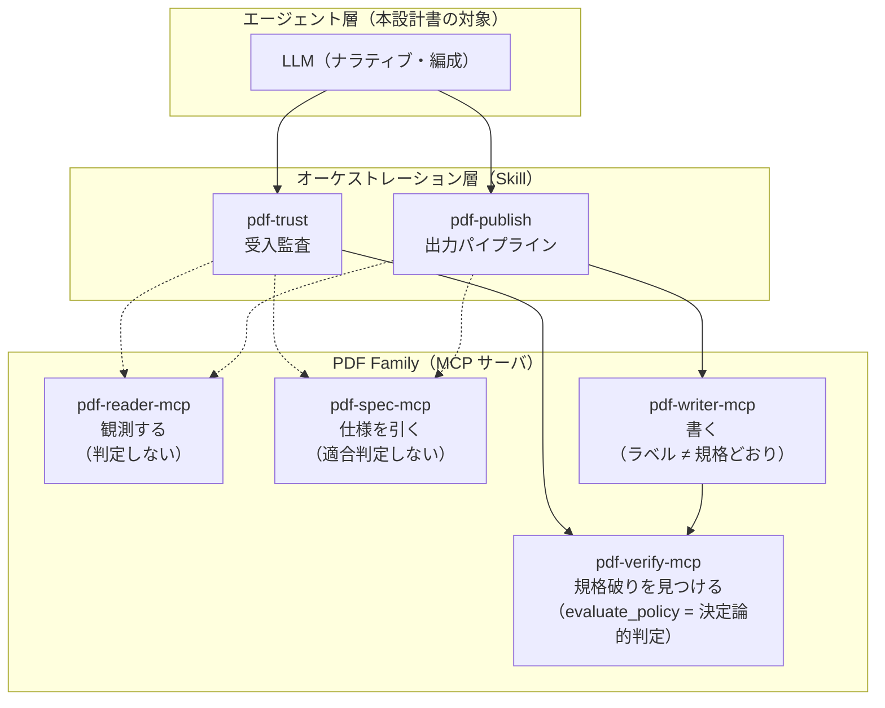
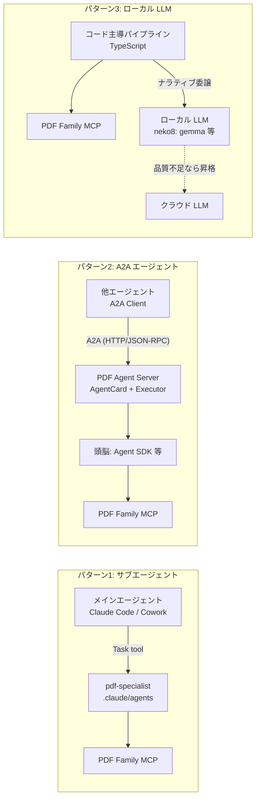
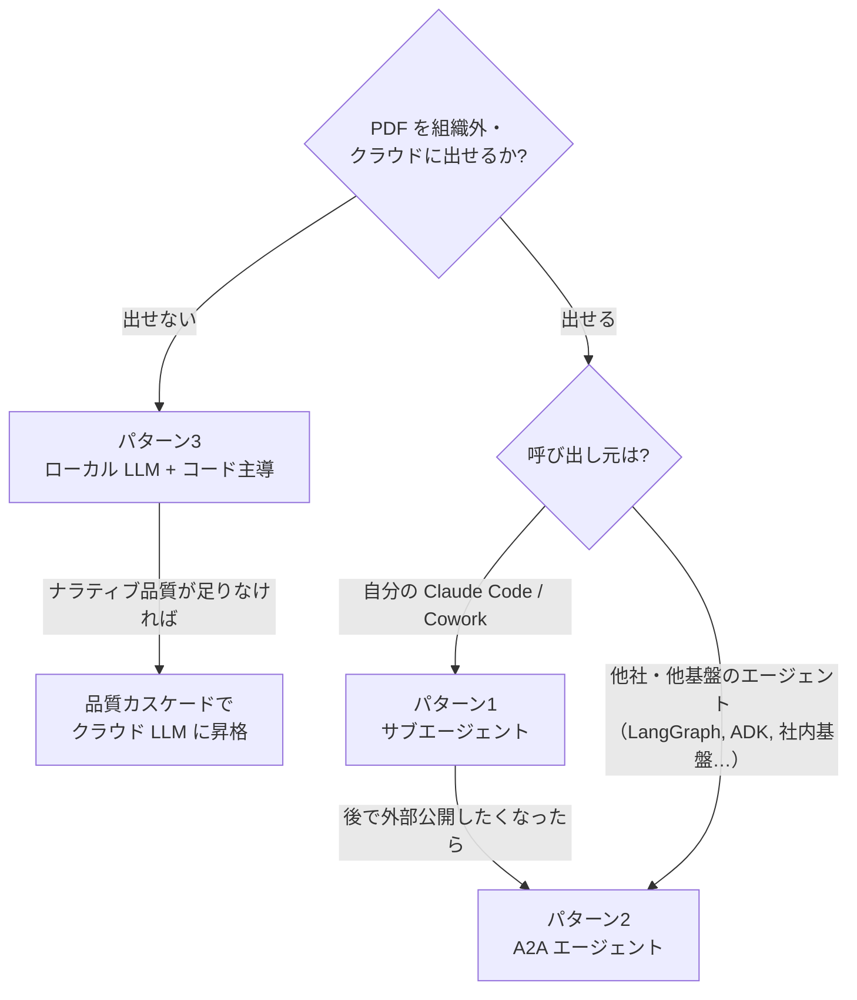
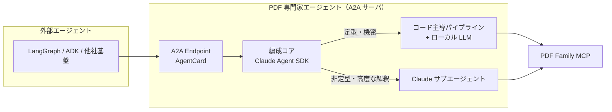

# PDF Family を用いた PDF 専門家エージェント 設計書

PDF Family（pdf-reader-mcp / pdf-spec-mcp / pdf-verify-mcp / pdf-writer-mcp）を
バックエンドとする「PDF 専門家エージェント」の構築パターンを整理する。

| ドキュメント | 内容 |
|---|---|
| README.md（本書） | 共通アーキテクチャ・パターン比較・選定ガイド |
| [01-claude-subagent.md](01-claude-subagent.md) | Claude Code / Cowork のサブエージェント（カスタムエージェント）構成 |
| [02-a2a-agent.md](02-a2a-agent.md) | A2A プロトコルによる独立エージェント構成 |
| [03-local-llm.md](03-local-llm.md) | ローカル LLM 構成（neko8 等）とコード主導パイプライン |

## 1. 前提 — PDF Family の認識論的分業

PDF Family は「観測・参照・判定・生成」を厳密に分離している。
**エージェント設計はこの分業を壊さないことが第一原則**であり、
どの構築パターンを選んでもこの層は共通の土台になる。

### エージェント化を支える 2 つの設計資産

1. **ジャッジはコード、ナラティブは LLM**
   4 値判定（trust_and_use / use_with_caution / human_review_required / reject）は
   `evaluate_policy` のルールエンジンが下す。LLM の仕事は firedRules の解説・
   推奨アクションの文章化に限られる。
   → **LLM の能力が判定品質に影響しない**。これがローカル LLM 構成（03）を成立させる鍵。
2. **`instructions` による射程宣言**（shuji-mcp-patterns §G）
   各サーバが「しないこと」を initialize 応答で宣言済み。
   → どのエージェント基盤に載せても、ツール誤用（reader の観測を判定として読む等）を
   システムコンテキスト段階で抑止できる。

## 2. 構築パターン比較

| 観点 | 1. サブエージェント | 2. A2A エージェント | 3. ローカル LLM |
|---|---|---|---|
| 実行場所 | 利用者の Claude Code / Cowork 内 | 独立サービス（常駐サーバ） | ローカルマシン内 |
| 頭脳 | Claude（親と同系） | 任意（Claude Agent SDK 推奨） | ローカル LLM + コード |
| 呼び出し元 | 親エージェント（Task tool） | 任意の A2A クライアント | CLI / スクリプト / MCP 経由 |
| 文脈分離 | ◎（サブエージェント固有文脈） | ◎（プロセス分離） | ◎（プロセス分離） |
| 複数 LLM 基盤からの利用 | ✗（Claude 系限定） | ◎（プロトコルで中立） | △（MCP として公開すれば可） |
| 機密性（PDF を外に出さない） | △（Claude API に渡る） | 構成次第 | ◎（判定はローカル完結） |
| ツール呼び出し信頼性 | ◎ | ◎（頭脳次第） | △ → コード主導で回避 |
| 導入コスト | 低（md ファイル 1 枚〜） | 中（サーバ実装・運用） | 中（パイプライン実装） |
| 実現性（2026-07 時点） | ◎ 今すぐ可 | ○ SDK 成熟途上（spec v1.0 / a2a-js は 0.3 系） | ○ 判定系は可・自由対話は 14B+ 必須 |

## 3. 選定ガイド

- **まず 1（サブエージェント）から始める**のが定石。PDF Family + pdf-trust / pdf-publish は
  既に Skill として動いており、サブエージェント定義は md 1 枚で足りる。
- **2（A2A）は「他基盤からの利用」が要件になった時点で**。中身（頭脳 + MCP 編成）は
  1 と同じものを A2A サーバで包むだけなので、1 → 2 は増築であり作り直しではない。
- **3（ローカル LLM）は機密要件が主導する場合**。判定はもともとコード
  （evaluate_policy / veraPDF）なので、ローカル LLM の弱さは急所にならない。

## 4. 全パターン共通の設計原則

1. **verdict の上書き禁止** — どの基盤でも、判定は `evaluate_policy` / veraPDF の結果を
   そのまま使う。エージェントのプロンプトに pdf-trust / pdf-publish と同じ禁止事項を書く。
2. **宣言と適合の分離** — `ensure_pdfa` / `ensure_tagged` を呼んだら対応 flavour の
   `validate_conformance` を必ず通す。エージェントの手順にハードコードする（LLM の裁量にしない）。
3. **絶対パス + `outputPath` 必須** — base64 溢れ（実測 3.9MB → 530 万文字）は
   どの基盤でも文脈を破壊する。A2A では FilePart の bytes/uri 選択にも直結する。
4. **縮退の明示** — 任意 MCP が未接続なら「未実施」と明記。黙って項目を落とさない。
5. **構造化された結果 + ナラティブの二層応答** — 機械可読な verdict / firedRules と、
   人間向け解説を分けて返す。A2A では Artifact を分ける、サブエージェントでは
   応答フォーマットを定義する、で実現する。

## 5. 発展形 — パターンの合成

3 パターンは排他ではない。最終形として次の合成が可能:

受け付けた依頼を「定型（判定・検証 → コード + ローカル LLM で安価に）」と
「非定型（仕様相談・複雑な監査解釈 → Claude で高品質に）」に振り分ける。
これは neko8 の品質カスケードの発想を A2A の入口まで引き上げたものに相当する。

## 参考資料

- A2A Protocol（Linux Foundation, spec v1.0 / 2026-05 に v1.0.1 で拡張機構追加）: https://github.com/a2aproject/A2A
- a2a-js SDK（protocolVersion 0.3 系で追随中）: https://github.com/a2aproject/a2a-js
- Claude Agent SDK subagents: https://platform.claude.com/docs/en/agent-sdk/subagents
- shuji-mcp-patterns Skill（instructions 射程宣言ほか実装パターン）
- pdf-trust / pdf-publish Skill（オーケストレーション手順の原本）
